# IceCubeSilmulation
Monte Carlo simulation to reproduce the geometry and emission angle of neutrinos in the IcueCube detector.

The IceCube Neutrino Observatory is a massive particle physics experiment located at the South Pole, and is designed to detect neutrinos, a massless and weakly-interacting particle.

**Background**
Cosmic rays are produced from extreme events in the universe, such as supernova remnants. When cosmic rays interact with matter, the interaction produces pions, which decay into neutrinos and gamma rays.

**How the Detector Works**
The IceCube detector is made of Antarctic ice and is burried beneath the surface of the ice.

Neutrinos are not observed directly. When they interact with the ice, the produce secondary particles the emit Cherenkov light, which is a result of the particles traveling faster through the ice than light passing through the ice. The sensors collect this light, which is digitized and time stamped.

